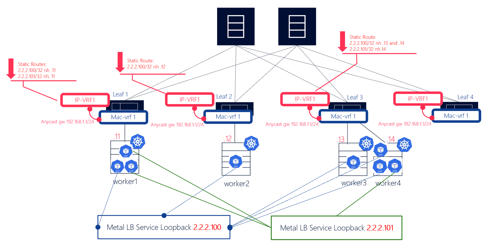

# Nokia SR Linux agent to implement Kubernetes aware load balancing in data centers

This repository contains the implementation of the method of load balancing for data centers presented in the master thesis “SR Linux agent for Kubernetes load balancing on data center fabrics” from João Carvalheiro. The mechanism proposed monitors the Kubernetes clusters and updates the configuration of the network making the load balancing within a data center fabric optimized even if the cluster changes

This contains the code of the SR Linux agent and the setup files for the lab environment where it was tested.

To deploy the test environment we use [Containerlab](https://containerlab.dev/) which help us to effortlessly create complex network topologies and validate features, scenarios. We also use [Minikube](https://minikube.sigs.k8s.io/) which is an open-source tool that facilitates running Kubernetes clusters locally to quickly test and experiment with containerized applications. Our k8s Cluster will feature [MetalLB](https://metallb.universe.tf/), which gives bare metal clusters the mechanism to assign external IPs to LoadBalancer type Kubernetes services.

The end service we will use on top of the kubernetes cluster is a Nginx HTTP echo server. This service will be deployed and exposed in all the k8s nodes. 

The following diagram represents the physical and logical topology.

## Topology

<p align="center">
 
</p>

## Goal

Demonstrate kubernetes MetalLB load balancing in L2 Mode using a Containerlab+Minikube Lab.

## Features

- Containerlab topology
- Minikube kubernetes cluster (4 nodes)
- MetalLB integration
- Preconfigured Leaf/Spine Fabric: 2xSpine, 4xLeaf SR Linux switches
- Anycast services
- Linux clients to simulate connections to k8s services (4 clients)

## Requirements

- [Containerlab](https://containerlab.dev/)
- [minikube](https://minikube.sigs.k8s.io)
- [Docker](https://docs.docker.com/engine/install/)
- [SR Linux Container image](https://github.com/nokia/srlinux-container-image)
- [kubectl](https://kubernetes.io/docs/tasks/tools/)

## Deploying the lab

```bash
# deploy minikube cluster
minikube start --apiserver-ips=172.20.20.1 --nodes 4 -p worker
```

```bash
# enable MetalLB addons
minikube addons enable metallb -p worker
```

```bash
# install MetalLB (native mode l2advertisement)
kubectl apply -f https://raw.githubusercontent.com/metallb/metallb/v0.13.12/config/manifests/metallb-native.yaml
```

```bash
# change the API server information in the config file of Kubernetes (/.kube/config) to the one you are going to setup the port forward to
server: https://172.20.20.1:49153
```

```bash
# on a different terminal setup the port forwarding
kubectl port-forward --address 172.20.20.1 kube-apiserver-cluster1 49153:8443 --namespace kube-system
```

```bash
# deploy containerlab topology
clab deploy --reconfigure -t srl-k8s-lab.clab.yml
```

```bash
# setup MetalLB
kubectl apply -f metallb.yaml
```

```bash
# Add k8s HTTP echo deployment and LB service
kubectl apply -f nginx.yaml
```

## Load Balancing Tests

```bash
# enter one of the clients sh shell
docker exec -it client3 /bin/sh

# enter virtual enviroment
. /app/venv/bin/activate

# run the script
python3 test_ecmp.py
```

This will generate a list of the number of requests answered by each pod.

## Performance Tests
Create a deployment named 'nginxhello' and run one of the these scripts.

```bash
# test that measures the time that the network takes to react to an increase in the number of pods
python3 c_add.py
```

```bash
# test that measures the time that the network takes to react to a decrease in the number of pods
python3 c_del.py
```

## Delete the lab

```bash
# destroy clab topology and cleanup 
clab destroy --topo srl-k8s-lab.clab.yml --cleanup
```

```bash
# delete Minikube cluster
minikube delete --all
```
